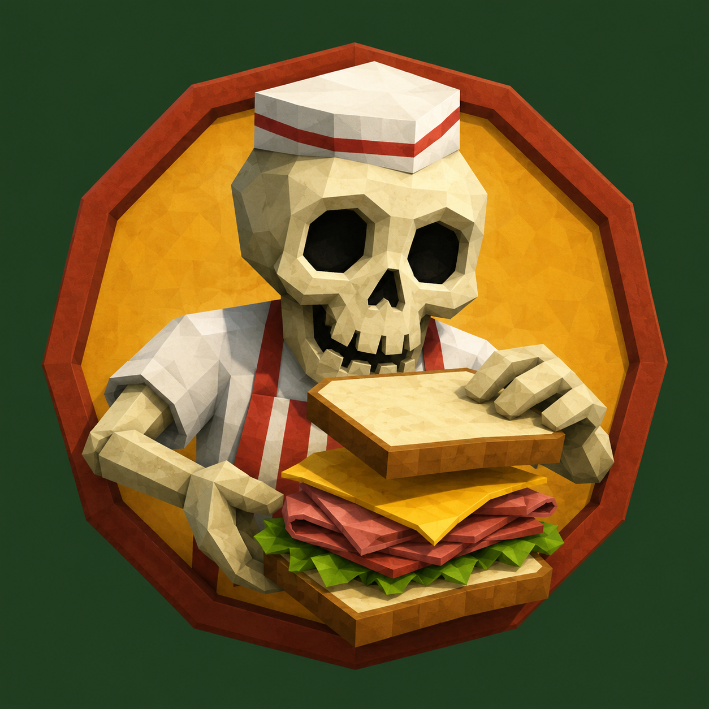

<p align="center">
  
</p>

# Deli Counter — a Blender level kit for Godot 4

_Stack a level like a sandwich: layer the parts, serve the whole._

## What this is, and why it's shaped this way

Deli Counter is a deterministic generator for the **static, replication-free
shell** of a multiplayer level — the geometry, collision, and traversal that is
identical on every client and never needs syncing — plus the **anchor points**
where your game's networked state layer attaches.

That's the whole thesis, and every design choice follows from it. In an online
multiplayer FPS, the expensive, bug-prone part is *state that has to stay in
sync across the network*: which doors are open, what's destroyed, where the
loot is now, who did what. The **building itself isn't that.** Walls, floors,
stairs, collision — that's immutable geometry, the same on every client
forever. It never needs replication because it never changes. It's baked.

So Deli Counter generates the part that *doesn't* replicate, and hands off the
part that does as **markers and metadata, not live objects.** The marker
empties, the `gameplay.json`, the breach panels, the spawn points — those
aren't game state. They're anchors that say "a breach *can* happen here, loot
*spawns* here, the objective socket *is* here." Whether it *has* happened,
what's *there now*, who *did it* — that's your netcode's job. The tool stops
exactly where networked state begins.

This is why the tool is the way it is:

- **Monolithic building on flat ground** isn't a limitation to apologize for —
  it's *correct* for a baked shell. You want one static mesh with baked
  collision, not a pile of networked pieces. The dynamic, multi-part, outdoor
  stuff the tool avoids is exactly the state-heavy territory it's deliberately
  *not* trying to own.
- **Deterministic seed** is load-bearing: a baked shell must be byte-identical
  across clients, or you get desync. Same seed → same building → nothing to
  reconcile.
- **Markers as anchors, not objects** is the entire interface. The tool emits
  *where* things attach; your game owns *what they are* at runtime.

(It pairs naturally with [gool](https://github.com/siliconight/gool), which
applies the same philosophy to audio: the deterministic mix is baked, networked
events are anchors. Same idea, different subsystem.)

## How it works

Spec-driven Blender level generator. You describe a building as a JSON
spec; the kit builds a monolithic compound in Blender 4.x with a separate
collision proxy and exports it for your game. Levels can also **kitbash** from
existing models — layering imported assets into the generated shell.

```
prompt  ->  specs/<name>.json  ->  build.py  ->  build/<name>.glb  ->  Godot plugin: import + walk
```

The whole thing is designed to live in source control and stay
self-documenting as the level set grows toward real game models.

## Quick start (no JSON required)

New here? See **[GETTING_STARTED.md](GETTING_STARTED.md)** for the five-minute
path from a fresh clone to a level you can walk in Godot.

Generate a complete, playable level from a preset recipe:

```
python new_level.py --list                          # see available recipes
python new_level.py --preset corner_deli --name my_lvl
python new_level.py --preset compound --name boss --floors 3
```

Presets: **bank**, **police_station**, **corner_deli**, **compound**,
**hospital**, **warehouse**, **suburban_safehouse**, **rowhome**,
**casino_tower** (run `--list` for modes each supports). Flags:
`--mode heist|assault|survival`, `--floors N`, `--no-basement`, `--scale-ref`
(1.8 m human proxies for a Blender scale check), `--no-audio` (strip the
acoustic bridge), `--vertex-nuance` (optional anti-flatness pass), `--rarity
common|uncommon|rare|very_rare|legendary` (optional building rarity for the
networked-door reveal). This writes
and validates a full spec — tactical layout, materials, spawns, vertical routes
— then prints the build command. Edit the generated JSON to customize, or build
it straight away with `build.py`.

There are three co-equal on-ramps, all optional: this **preset** path, a guided
**interview** (`python describe.py`), or **hand-authored JSON**. Nothing depends
on the others — use whichever fits.

## Layout

```
deli_counter/
  deli_counter.py     core builder (needs Blender's bpy)
  spec_types.py       spec dataclasses (pure Python, no bpy)
  spec_loader.py      JSON/YAML -> LevelSpec
  rarity.py           canonical building-rarity tier+colour table (pure Python, no bpy)
  version.py          KIT_VERSION / SCHEMA_VERSION (stamped into manifests)
  build.py            CLI: drives Blender headless (--all, --watch)  (normal Python)
  validate.py         check a spec without Blender         (normal Python)
  tactical.py         reachability graph + path metrics + mode scorecards
  polybudget.py       offline triangle-budget estimator    (normal Python)
  guards.py           hard gates: IP-name + step-rise      (normal Python)
  navigability.py     offline nav proxy (doorway width + connectivity)
  floorplan.py        top-down floorplan SVG per story      (normal Python)
  meshlib_kit.py      manifest for the optional GridMap parts-kit
  presets.py          parametric level recipes (see --list)
  new_level.py        CLI: generate a spec from a preset   (normal Python)
  describe.py         optional guided interview -> spec     (normal Python)
  catalog.py          generate specs/CATALOG.md            (normal Python)
  check.py            full gate for CI                     (normal Python)
  install_hooks.py    install the pre-commit IP-name guard
  _run_in_blender.py  executed inside Blender by build.py
  schema/
    level.schema.json JSON Schema (editor autocomplete + validation)
  specs/              worked examples + presets; CATALOG.md (auto-generated)
  build/              outputs (binaries + floorplans gitignored, manifests tracked)
  godot/              Godot 4 integration (see godot/README.md):
                        deli_counter_postimport.gd  import hook (markers->nodes)
                        deli_level.gd               runtime query/breach helper
                        template/                   walkable test harness scene
                        addon/deli_counter/         editor plugin (one-click play)
                        IMPORT_GUIDE.md NAVMESH_CHECK.md VERTEX_NUANCE.md MESHLIB_KIT.md
  .github/workflows/  CI: runs check.py on push/PR
  README.md  CHANGELOG.md  GETTING_STARTED.md  .gitignore  package.py
```

## Export formats

| Format | Ext | Use | In source control |
|---|---|---|---|
| glTF binary | `.glb` | Engine-ready. Godot reads collision tags on import. Single file. | gitignored (regenerable) |
| glTF separate | `.gltf` + `.bin` + textures | Web / AR/VR, more granular | gitignored |
| Wavefront OBJ | `.obj` + `.mtl` | Static archival; text, diffs well | gitignored |

Pick one or several:

```
python build.py specs/bank.json                 # glb (default)
python build.py specs/bank.json -f glb,obj      # both
python build.py specs/bank.json -f gltf
python build.py --all -f glb,obj                # every spec, both formats
```

**OBJ caveat:** OBJ has no node-name convention, so Godot's OBJ importer
ignores the `-colonly` collision tags. Use **GLB for the Godot pipeline**
(collision wired automatically) and OBJ as the static/interchange/archival
format. Both come from the same build.

## One-time setup

- Blender 4.x. The CLI finds it via `--blender`, `$BLENDER`, or `PATH`.
- Optional: `pip install jsonschema` (full validation), `pip install pyyaml`
  (YAML specs).

## The build commands

```
python validate.py specs/bank.json    # fast check, no Blender
python build.py specs/bank.json        # -> build/bank.glb (+ manifest)
python build.py --all -f glb,obj       # rebuild everything, two formats
```

### Manual fallback (GUI)

1. Blender 4.x -> Scripting workspace.
2. Open `_run_in_blender.py`, set `SPEC_PATH` (and `OUT_PATH`) to absolute
   paths, Alt+P.

## Source-control workflow

The repo is the source of truth; built models are regenerable artifacts.

**Tracked:** all `.py`, `schema/`, `specs/*.json`, `specs/CATALOG.md`,
`CHANGELOG.md`, and `build/*.manifest.json`.

**Ignored:** `build/*.glb|gltf|obj|mtl|bin` — regenerate with `build.py`.
(To ship a frozen release model, whitelist it explicitly in `.gitignore`.)

**Every build writes a manifest** (`build/<name>.manifest.json`) recording
kit version, schema version, a spec content hash, timestamp, and the formats
produced. So any model is traceable to the exact spec + kit version that
made it — even though the binary itself isn't committed.

**Before committing a spec change**, run the gate:

```
python catalog.py     # refresh CATALOG.md
python check.py        # validate all specs + confirm catalog is current
```

`check.py` exits non-zero on failure, so it drops straight into a pre-commit
hook or CI job. Neither needs Blender.

**Skip the manual step:** `new_level.py` auto-refreshes `CATALOG.md` after it
writes a spec, and `python install_hooks.py` installs a pre-commit hook that
refreshes the catalog and runs the gate before every commit — so a stale
catalog or a broken spec can't reach CI. Run the installer once per clone.
(Bypass the hook for a one-off commit with `git commit --no-verify`.)

### Versioning

`version.py` holds `KIT_VERSION`. Bump it when builder output changes, record
the change in `CHANGELOG.md`. Convention: MAJOR = schema break, MINOR = new
feature (old specs unchanged), PATCH = geometry fix.

### CI

`.github/workflows/check.yml` runs `python check.py` on every push and PR to
`main` — validates all specs (schema + loader + tactical rules) and confirms
`CATALOG.md` is current. No Blender needed; a bad spec fails CI server-side.

### Versioned release packages

`python package.py` builds `dist/deli_counter-<KIT_VERSION>.zip` (named from
`version.py`) and writes a `VERSION` stamp file. `dist/` is gitignored —
attach the zip to a GitHub Release rather than committing it. `python
package.py --check` prints the version that would be packaged.

## Import into Godot 4

**Easiest path — the editor plugin.** Install the plugin once
(`godot/addon/deli_counter/` → `res://addons/deli_counter/`, then enable
**Deli Counter** in Project Settings → Plugins). A dock appears: drop a
level's `.glb` + `.gameplay.json` into your project, click **Pick level
.glb…**, then **Set up & Play ▶**. It assigns the import hook, reimports,
builds a walkable test scene, and runs it — no Import-tab steps, no manual
scene wiring. See `godot/addon/deli_counter/README.md`.

**What import does under the hood** (the plugin automates this; you can also
do it by hand). Dropping the `.glb` in, the importer reads collision suffixes:

- `-convcolonly` -> `StaticBody3D` + `ConvexPolygonShape3D`
- `-colonly`     -> `StaticBody3D` + `ConcavePolygonShape3D` (trimesh)

`VISUAL` meshes import with no collision. `breach` openings produce a tagged
`*_BREACHPANEL` (visual + collision) to swap for a destructible body.

**Turning markers into game nodes:** an `EditorScenePostImport` hook converts
the baked marker empties (spawns, objectives, sockets, cover, hatches,
NAV_REGIONs) into `Marker3D` nodes in gameplay groups — or instances of your
own scenes — and tags breach panels with metadata. A runtime helper
(`DeliLevel`) queries them and breaches panels. The plugin assigns this hook
for you; to do it manually, set it as the `.glb`'s Import Script and reimport.
See `godot/README.md` and `godot/IMPORT_GUIDE.md`.

**Walking a level:** the plugin's test scene (or `godot/template/`
`level_test.tscn` by hand) gives you a player sized to the scale guidelines
(1.8 m capsule, 1.6 m eye), with stair-stepping so generated stairs are
climbable, plus a navmesh-bake key and respawn-at-spawn-marker. Use it to
confirm scale and collision before dressing the level.

> The Godot plugin and test harness are the newest pieces. The import pipeline
> (collision + markers) is confirmed working in a real Godot project; the
> plugin's one-click flow is written against the Godot 4.x editor API and
> should be smoke-tested in your engine.

## Writing a spec

JSON matching `schema/level.schema.json`. The `$schema` key in each example
gives editor autocomplete. Coordinates: origin at building center,
ground-floor slab top at `z=0`, `+X` east, `+Y` north, `+Z` up, meters.

Top-level: `name`, `seed`, `grid`, `footprint_x/y`, `story_height`,
`n_stories`, `has_basement`, `wall_thick`, `floor_thick`, `collision`,
`auto_exterior`.

Features: `ext_walls` (+ `openings`: door/window/garage/breach),
`partitions`, `stairs` (auto-cut slab holes; step count derives from floor
height), `ladders` / `ramps` / `vault_ledges` (full vertical traversal set),
`slab_holes`, `volumes`
(vaults/counters/cover/mezzanines), `parapets`. Same spec + same `seed`
always builds the same level. See `specs/CATALOG.md` for what's in each level.

## Kitbashing — composing levels from existing models

Levels aren't limited to generated primitives. A spec can pull in external
model assets and place instances of them, baked into the monolithic level
alongside the generated geometry.

Two spec sections:

- **`assets`** — a library of source models, each with a stable `id`:
  ```json
  { "id": "crate", "file": "props/crate.obj", "fmt": "obj", "collision": "convex" }
  ```
- **`placements`** — instances referencing an asset `id`, with transform:
  ```json
  { "asset": "crate", "x": -6, "y": -4, "z": 0, "rot_z": 15, "scale": 1.5 }
  ```

Multiple placements can reuse one asset id. Asset files are **vendored under
`assets/`** and committed — see `assets/README.md`. Formats: `.glb`
(preferred), `.obj` (+ `.mtl`), `.blend` (appended; set `blend_object` to
pick one object).

**Collision for imported models** is the key choice. Each asset declares a
default strategy; a placement can override it:

- `convex` (default) — auto convex hull. Fast, one shape. Best for most props.
- `box` — axis-aligned bounding box. Cheapest.
- `file` — a separate low-poly mesh (`collision_file`). For concave shapes a
  hull can't capture.
- `trimesh` — the asset mesh itself, concave. Static, costly.
- `none` — visual only.

Imported collision gets the same `-convcolonly` / `-colonly` tags as
generated geometry, so Godot wires it up on GLB import. `validate.py` checks
every placement points at a defined asset and that vendored files exist —
before Blender ever launches. See `specs/kitbash_demo.json` for a worked
example.

## Tactical layer — playable level packages

Beyond geometry, a spec can describe **gameplay meaning**. All of this is
optional — a plain building spec omits it and still builds.

### Three modes

A spec's `mode` selects the tactical style; validation and the scorecard
branch on it:

- **`assault`** (default) — symmetric attacker/defender play: multiple entry
  routes, breachable walls, objective rooms to take and hold, verticality.
- **`heist`** — PvE crew play: independent `objectives` (any order), a `loot`
  economy (`value`/`bags`/`kind`), `zones` (`extraction`/`secure`/`drop`),
  and `phase`-tagged spawns (stealth/alarm/loud/escape — the state machine
  lives in your game code). Validation checks the heist loop is completable
  (extraction exists, objectives reachable, loot deliverable) rather than the
  breach rules.
- **`survival`** — co-op PvE horde defense, as a directional run *through the
  building*: the team starts in a `safe_room` zone, moves through the level,
  and reaches a `finale` holdout zone to survive a final wave (optionally an
  `extraction` zone for the rescue/escape). New markers: `survivor_spawn`
  (team start), `horde_spawn` (where AI pours in), `rescue` (escape point).
  Room roles `safe_room` / `finale` / `route_node` read as hints. Validation
  checks the run is playable — there's a start and a finale, **the finale is
  reachable from the start through the building**, and there are horde spawns
  to apply pressure. The AI director / wave state machine lives in your game
  code; the level provides the geometry and spawn points. (Scoped to
  single-building runs — an outdoor path-through-a-town map is the same
  open-space limitation the tool has for outdoor levels generally.)

Existing concepts (`rooms`, `vertical_links`, tactical openings) apply to all
three modes.

- **`rooms`** — named spaces with `bounds` `[min_x, min_y, max_x, max_y]`,
  `role` (`public_entry`, `objective_room`, `connector`, `fortifiable`…),
  `combat_range`, `fortifiable`. Drive reachability/route validation and the
  scorecard; emitted as `NAV_REGION_*` markers.
- **`vertical_links`** — designed vertical interactions: `stair` (rotation),
  `floor_hole` (vertical angle, cuts the slab), `hatch` (breachable drop).
- **`markers`** — gameplay points: `attacker_spawn`, `defender_spawn`,
  `objective`, `extraction`, `cover_low/high`, `camera_socket`,
  `patrol_point`, `loot`, etc. With optional `id`, `room`, `rot_z`, `meta`.
- **Tactical openings** — `door`/`window`/`breach`/`garage` carry optional
  `tag`, `breach_class`, `material`, `vaultable`, `reinforceable`.

**Delivered to Godot two ways**: named Empties baked into the GLB (a
`MARKERS` collection — `ATTACKER_SPAWN_A`, `OBJECTIVE_A`, `DOOR_SOCKET_*`,
`BREACH_PANEL_*`, `NAV_REGION_*`, `HATCH_*`) **and** a companion
`<name>.gameplay.json` next to the GLB for parsing without walking node names.

**Validation checks tactical quality**, not just that it builds:
≥2 attacker entries, every floor has vertical access, objective rooms have
≥2 access paths, no unreachable rooms, minimum opening width, breach metadata
present. `validate.py` hard-fails on these and prints a **scorecard**:

```
  scorecard for rowhouse_raid:
    floors: 3   rooms: 7   markers: 6
    attacker entries: 4   objective rooms: 1   breach points: 4
    vertical links: 4   unreachable rooms: 0
    errors: 0   warnings: 0
```

See `specs/rowhouse_raid.json` for a full tactical level. Sightline analysis
and an in-engine nav smoke test are a planned Godot-side Phase 2 (they need
real geometry raycasts).

### Building rarity — value for the door reveal (optional)

A building can declare one `rarity` (`common` / `uncommon` / `rare` / `very_rare` /
`legendary`), e.g. `"rarity": "legendary"` in the spec or
`--rarity legendary` on `new_level.py`. The build stamps the tier and its one
canonical colour (white / green / blue / purple / gold) onto `gameplay.json`
and onto **every** entry anchor of the building (any door / window / breach), so a
networked door can pop the right colour the instant it opens — the "open a
Legendary chest, but it's a whole building" reveal. One building has one rarity:
every entry carries it plus the building's id, so whichever door the squad opens
first, they all resolve to the same building and colour (the reveal-on-first,
once, shared across the squad is server state — game code). It's a contract
*value*, not a baked effect: the reveal itself (light, sound, HUD banner) and any
rarity-driven enemy/loot budgets are game code that reads the value. Off by
default. See **`docs/RARITY.md`** for the tier table, the multi-entry model, and
the Godot wiring.

### Path metrics — intel, not judgment

The validator also reports **path-analysis metrics** on the room graph: how
many node-disjoint routes reach each objective/finale (a flanking measure),
the shortest run length in hops, and **chokepoints** (rooms every route is
forced through). These are computed offline and shown in the scorecard.

They are **information for whoever builds gameplay on the model, not the tool's
opinion.** Deli Counter makes models, not gameplay — a single route to a vault,
a short run, or a chokepoint at the one stairwell may be exactly the design the
gameplay engineer intends. The tool reports the shape of the building; it does
not warn or fail on these. The *only* hard path gate is **reachability** — if
an objective or finale is physically unreachable through the geometry, that's a
broken model and the build fails. Everything past "can you get there at all" is
intel the gameplay layer interprets.

### Poly budget — intel, not judgment

`validate.py` prints an **offline triangle-budget estimate** per build: the
total tri count and the heaviest single piece, against the Environment budget
(~50-500 target, 1000 cap per piece). Like path metrics, it's information, not a
gate — Deli Counter shells are deliberately light blockouts. It's there so you
can see at a glance whether a level is in the expected range before you ever open
Blender.

### Navigability — offline proxy + a real navmesh check

Two layers answer "can an AI agent (and therefore an enemy) actually path
through this?":

- **Offline proxy** (`navigability.py`, runs in `validate.py`/CI): flags
  floor-level doorways narrower than a nav agent can pass (~1.1 m for a 0.5 m
  agent) and backstops isolated-room detection. It's a room-graph pre-filter —
  reported as warnings, since narrow doors are a legitimate choice if your agents
  are smaller. A cheap "no obvious blocker" check before Blender.
- **Real navmesh check** (Godot harness): press **F4** to bake a navmesh, then
  **F5** to query a path from the player to every gameplay marker and report what
  an agent can actually reach. This is the authoritative answer — it catches what
  the offline proxy can't (slivers, stair-bake gaps). See
  `godot/NAVMESH_CHECK.md`.

### Floorplan intel maps

Every validated spec writes an annotated **top-down SVG per story** to
`build/floorplans/` — rooms as role-colored boxes, walls with gaps at doorways,
gameplay markers as icons, a legend and north arrow. Pure-Python SVG (no
Pillow/cairo), so it's offline and deterministic. It turns the spatial intel the
tool computes into something a designer can actually *see* and pass around to
discuss flow. Also runnable standalone: `python floorplan.py specs/<name>.json
<outdir>`.

## Optional visual passes

Both of these are **off by default** — the pure, honest greybox is the default
output. Reach for them when you want them.

### Vertex nuance (anti-flatness)

`--vertex-nuance` (or `"vertex_nuance": true` in a spec) applies a visual-only
pass that makes a blockout read less like a flat CG box — densify visual faces to
grid scale, bevel hard edges so light catches, and bake procedural vertex colors
(geometry-derived fake AO, a floor-grime gradient, and a floor/wall/ceiling base
tint). No UVs, no textures, no hand-painting; the color ships in the `.glb`.
Collision is never touched. It's for *readability, not beauty* — just enough to
communicate the space. To display it in Godot, enable Vertex Color → Use as
Albedo on the material. See `godot/VERTEX_NUANCE.md`.

### GridMap parts-kit

An optional `MeshLibrary` of grid-aligned modular pieces (wall, doorway, floor,
stair, counter, crate…) you can paint with in a Godot `GridMap` to hand-greybox a
fresh layout by eye. It's the loosest on-ramp — a quick-sketch tool beside the
spec-driven pipeline, not a replacement (a live GridMap is not the deterministic
baked shell). Generate it by running `addons/deli_counter/meshlib_kit.gd` in
Godot. See `godot/MESHLIB_KIT.md`.

## Acoustic materials (optional audio-engine bridge)

**This is entirely optional.** Deli Counter builds the same playable shell with
or without it. If your game doesn't use an acoustic audio engine, ignore this
section — omit the `materials` block (or generate with `--no-audio`) and the
build still produces collision, markers, and geometry exactly the same. The
`gameplay.json` just carries an empty `surfaces` list, which a game not using it
simply never reads. Nothing about the tool *requires* the audio bridge.

For games that *do* want it: Deli Counter doesn't bake visual materials — you
texture in your engine. What it can optionally carry is the **acoustic** side,
so a surface's material feeds an audio engine's occlusion/reverb system (e.g.
[gool](https://github.com/siliconight/gool)).

Define a palette and reference it per surface:

```json
"default_material": "brick_ext",
"materials": [
  { "id": "brick_ext", "acoustic": "Concrete", "absorption": 0.7, "damping": 0.6 },
  { "id": "drywall",   "acoustic": "Drywall" },
  { "id": "glass",     "acoustic": "Glass", "absorption": 0.1, "damping": 0.05 }
],
"partitions": [
  { "story": 0, "axis": "X", "pos": 0, "start": -9, "end": 9, "material": "drywall", "openings": [...] }
]
```

Each material maps to an audio-material enum name
(Default/Air/Glass/Wood/Drywall/Concrete/Metal/Curtain/Foliage) and/or
explicit `absorption`/`damping` floats. Walls, partitions, and volumes take a
`material` id; `default_material` covers anything unset.

The build writes a `surfaces` map into `<name>.gameplay.json` — collision
node name → resolved acoustic material. Your audio raycaster hits a collision
body, reads its name, looks it up here, and hands the material to the audio
engine's geometry-query interface. `validate.py` checks every reference
resolves.

The presets include an acoustic palette by default (harmless if unused), but
`python new_level.py --preset X --no-audio` strips it entirely if you'd rather
the spec carry no audio data at all.

## Iterating toward real models

**Hit ~80% of what you want and need manual adjustments?** See
`docs/CUSTOMIZING.md` for how to close the gap without breaking determinism. The
short version: the `.glb` is disposable, the spec is what you iterate — edit the
spec and rebuild rather than hand-editing the model, so every build stays
reproducible. The doc has a full decision tree for the rare detail the spec can't
express.

Sizing a level? See `docs/scale_guidelines.md` for meter-based targets —
player scale, grid sizes, per-mode building/room/route dimensions, and a
recommended first-prototype canvas.

To eyeball scale in Blender, set `"scale_ref": true` in a spec and rebuild:
1.8 m human-proxy capsules appear at every spawn in a `SCALE_REF` collection
(visible in the viewport, never exported). If a doorway towers over the proxy
and walls clear its head, your scale is right.

1. Describe a building -> a new `specs/<name>.json` (or `new_level.py --preset`).
2. `validate.py` -> `build.py` -> import with the Godot plugin and **walk it**
   in the test harness (checks scale + collision before you dress anything).
3. Tweak the spec (move walls, add entries, resize) and rebuild — deterministic.
4. As the builder gains fidelity (materials, prefab props, destructible
   pieces), bump `KIT_VERSION` and rebuild all levels with `--all`.
5. `catalog.py` + `check.py` keep the repo self-describing and consistent.
